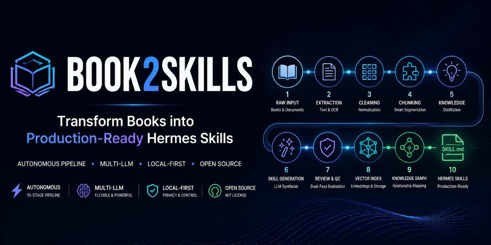

# 📚 Book2Skills

<p align="center">
  
</p>

[](https://github.com/Abdulrahman0Khaled/BOOK2SKILLS/actions)
[](https://opensource.org/licenses/MIT)
[](https://www.python.org/downloads/)
[](https://github.com/astral-sh/ruff)
[](https://www.trychroma.com/)

> **The Autonomous, Production-Ready Pipeline Transforming Books & Complex Literature into High-Precision Executable AI Agent Skills (OpenClaw, Claude, Codex, Hermes, etc.).**

---

## 📖 Table of Contents

- [🚀 Why Book2Skills?](#-why-book2skills)
- [✨ Core Strengths & Key Features](#-core-strengths--key-features)
- [🧠 Universal LLM Integration & Local Execution](#-universal-llm-integration--local-execution)
- [📚 Universal Document & Book Support](#-universal-document--book-support)
- [🏗️ The 10-Stage Agentic Pipeline](#️-the-10-stage-agentic-pipeline)
- [⚡ Quick Start Guide](#-quick-start-guide)
- [🎮 Interactive Studio (TUI)](#-interactive-studio-tui)
- [🖥️ Comprehensive CLI Reference](#️-comprehensive-cli-reference)
- [🌐 REST API Reference](#-rest-api-reference)
- [⚙️ Configuration & Environment Settings](#️-configuration--environment-settings)
- [📜 AI Agent Skill Protocol Standard](#-ai-agent-skill-protocol-standard)
- [🐳 Docker & Containerized Deployment](#-docker--containerized-deployment)
- [🧪 Testing & Quality Assurance](#-testing--quality-assurance)
- [📄 License & Credits](#-license--credits)

---

## 🚀 Why Book2Skills?

Books and long-form literature contain humanity's highest-value knowledge—yet for AI Agents, raw unstructured text is passive, noisy, and difficult to execute reliably. 

**Book2Skills** bridges the gap between passive reading and active execution. It is an enterprise-grade, agentic orchestration engine designed to digest long-form business, technical, financial, and domain literature, distill out core frameworks, and synthesize **production-ready, standardized AI Agent Skills (`SKILL.md`)** compatible with AI frameworks such as **OpenClaw, Claude, Codex, Hermes**, and others.

Whether you are building specialized autonomous agents, constructing enterprise knowledge bases, or deploying privacy-first on-premise AI systems, **Book2Skills** automates knowledge extraction with unmatched precision, structural rigor, and zero manual overhead.

---

## ✨ Core Strengths & Key Features

### ⚡ Autonomous 10-Stage Pipeline
Transforms raw files through a deterministic 10-stage process: from raw extraction to semantic deduplication, LLM-powered review, vector embedding indexing, and knowledge graph mapping.

### 🧠 Dual-Model LLM Intelligence
Optimizes speed and cost by pairing a **Fast/Small LLM** (e.g., GPT-4o-mini, Qwen 2.5 14B) for structural extraction and semantic chunking with a **Reasoning/Large LLM** (e.g., GPT-4o, Claude 3.5 Sonnet) for synthesis and dual-pass quality review.

### 🌐 Total Ecosystem & Local Flexibility
Runs seamlessly on cloud LLM APIs (OpenAI, Anthropic, Gemini, DeepSeek, OpenRouter) or **100% locally and offline** using Ollama, vLLM, LM Studio, or LocalAI for total data sovereignty and privacy.

### 📚 Comprehensive Document Ingestion
Natively ingests digital PDFs, Microsoft Word (`.docx`/`.doc`), Markdown (`.md`), plain text (`.txt`), and scanned books via hybrid OCR (Tesseract).

### ⚖️ Autonomous Dual-Pass LLM Quality Control
Evaluates generated skills on a 1-10 quality scale, validating structural compliance, eliminating vagueness, and tagging skills with high-relevance semantic categories.

### 🔍 Vector Search & Semantic Deduplication
Built-in `sentence-transformers` embeddings and persistent `ChromaDB` vector storage perform cosine similarity checks to purge duplicate skills and enable instant vector queries.

### 🕸️ Automated Knowledge Graph Synthesis
Discovers conceptual dependencies between extracted skills to construct an interconnected network of actionable domain knowledge.

### 🎮 Zero-Friction Interactive Studio (TUI)
An elegant, interactive terminal interface that allows anyone to manage books, execute pipelines, search skills, and export markdown bundles without memorizing terminal commands.

---

## 🧠 Universal LLM Integration & Local Execution

**Book2Skills** is completely provider-agnostic. You can switch between providers or run completely offline with a single environment variable edit in `.env`:

| Provider | Local / Cloud | Model Flexibility | Recommended Use Case |
| :--- | :---: | :--- | :--- |
| **Ollama** | 🏠 **100% Local** | Qwen 2.5, Llama 3.1, DeepSeek-R1, Mistral | Zero-cost, 100% offline, privacy-first local runs |
| **OpenAI** | ☁️ Cloud | GPT-4o, GPT-4o-mini, o3-mini | Enterprise speed and maximum structural reliability |
| **Anthropic** | ☁️ Cloud | Claude 3.5 Sonnet, Claude 3.5 Haiku | Exceptional synthesis, procedural coding, & nuance |
| **DeepSeek** | ☁️ Cloud | DeepSeek-V3, DeepSeek-R1 | Ultra-high performance reasoning at unbeatable cost |
| **Google Gemini**| ☁️ Cloud | Gemini 1.5 Pro, Gemini 1.5 Flash | Large-context processing and deep chapter analysis |
| **OpenRouter** | ☁️ Cloud | Access to 200+ models globally | Instant model benchmarking and flexible routing |

### 🔒 100% Offline Local Configuration Example (`.env`)
```env
B2S_LLM__PROVIDER=ollama
B2S_LLM__MODEL_SMALL=qwen2.5:14b
B2S_LLM__MODEL_LARGE=qwen2.5:14b
B2S_LLM__BASE_URL=http://localhost:11434/v1
```

---

## 📚 Universal Document & Book Support

**Book2Skills** accepts diverse domain books and unstructured documents across all major file formats:

- **PDF Files (`.pdf`)**: Direct text extraction with automatic fallback to **Tesseract OCR** for scanned pages, image-heavy manuals, or legacy books.
- **Microsoft Word (`.docx`, `.doc`)**: Structured extraction preserving headings, bullet structures, and tabular data.
- **Markdown & Plain Text (`.md`, `.txt`)**: Direct zero-loss ingestion for developer docs, playbooks, and text archives.
- **Multi-Domain Applicability**: E-Commerce, Software Engineering, Business Strategy, Sales & Marketing, Project Management, Finance, Law, Medicine, and Self-Help literature.

---

## 🏗️ The 10-Stage Agentic Pipeline

```
  [ Raw Book File ]
          │
          ▼
   1. 📄 Extract         ── Native PDF/DOCX Parsing + Hybrid Tesseract OCR
          │
          ▼
   2. 🧹 Clean           ── Header/Footer Purging & Layout Normalization
          │
          ▼
   3. ✂️ Chunk           ── Semantic Heading-Aware Chunking (Context-Aware)
          │
          ▼
   4. 🧠 Knowledge       ── Extract 12 Units (Rules, Workflows, Anti-Patterns...)
          │
          ▼
   5. ⚡ Skill Gen        ── Formulate Universal Agent Protocol SKILL.md Standard
          │
          ▼
   6. ⚖️ Review           ── Autonomous Dual-Pass LLM Quality Scoring (1-10)
          │
          ▼
   7. 🔍 Dedup            ── Cosine Vector Similarity Deduplication (ChromaDB)
          │
          ▼
   8. 🕸️ Graph            ── Inter-Skill Knowledge Graph Link Synthesis
          │
          ▼
   9. 📐 Embeddings       ── Generate Local sentence-transformers Vector Indices
          │
          ▼
  10. 💾 Storage          ── Persist Vector DB & Export Ready SKILL.md Bundles
```

### Knowledge Unit Types Extracted
The pipeline identifies and categorizes 12 core knowledge structures:
- 🛠️ `skill`: Direct actionable procedure
- 💡 `best_practice`: Recommended field-tested pattern
- ⚠️ `anti_pattern`: Known flawed approach to avoid
- 📜 `rule`: Hard constraint or mandatory condition
- 🔄 `workflow`: Step-by-step process orchestration
- ✅ `checklist`: Verification or audit items
- 🎯 `framework`: High-level conceptual strategy
- 🌲 `decision_tree`: Conditional branching logic
- ❌ `common_mistake`: Frequent practitioner pitfall
- 📝 `template`: Standardized boilerplate structure
- 📌 `example`: Concrete real-world instantiation
- 📚 `reference`: Key terminology and source mapping

---

## ⚡ Quick Start Guide

### 1. Prerequisites & Installation

Ensure you have **Python 3.11+** installed.

```bash
# Clone repository
git clone https://github.com/Abdulrahman0Khaled/BOOK2SKILLS.git
cd BOOK2SKILLS

# Create and activate virtual environment
python -m venv .venv
# Linux/macOS:
source .venv/bin/activate
# Windows (PowerShell):
.venv\Scripts\Activate.ps1

# Install core package with all dependencies
pip install -e ".[all]"
```

### 2. Configuration Setup

Copy the standard environment template:
```bash
cp .env.example .env
```

Open `.env` and set your preferred LLM configuration (e.g., OpenAI or local Ollama).

### 3. Processing Your First Book

Place your book files (`.pdf`, `.docx`, `.md`) into the `books/` or `data/` directory, then launch the interactive studio or run the pipeline directly:

```bash
# Option A: Launch Interactive Studio (Recommended)
book2skills studio

# Option B: Run pipeline via CLI
book2skills run all --incremental
```

---

## 🎮 Interactive Studio (TUI)

Launch the visually rich, arrow-key menu driven Terminal User Interface:

```bash
book2skills studio
```

```text
╔═════════════════════════════════════════════════════════════════════════╗
║   📚  BOOK-TO-SKILLS STUDIO                                             ║
║   Turn books into ready-to-use AI Agent Skills (OpenClaw, Claude...)    ║
╚═════════════════════════════════════════════════════════════════════════╝

❯ Choose an action:
   👉 🚀  Run pipeline — all books
      📄  Run pipeline — single book
      ⚙️  Configure LLM Provider
      📋  List available books
      📦  List generated skills
      🔍  Search skills database
      📤  Export SKILL.md files
      📊  View system statistics
      🗑️  Clear pipeline cache
      🚪  Exit Studio
```

- **Interactive LLM Provider Wizard**: Easily switch between OpenAI, Anthropic, Gemini, DeepSeek, OpenRouter, and Ollama directly from the terminal without manual `.env` editing.
- **Live Progress Bars**: Real-time stage indicators showing step completion (`extract → clean → chunk...`).
- **Colorized Summaries**: Rich tables displaying quality scores, skill counts, and categories.
- **Zero Command Syntax Required**: Entirely navigable via keyboard arrow keys and `Enter`.

---

## 🖥️ Comprehensive CLI Reference

The CLI entrypoint command is `book2skills` (or `python -m book_to_skills`).

### Pipeline Execution Commands

```bash
# 1. Run full pipeline on all books in the data directory (with incremental caching)
book2skills run all --incremental

# 2. Run full pipeline on a specific book file
book2skills run pipeline path/to/book.pdf

# 3. Run specific stages only (e.g., extract, clean, and chunk)
book2skills run pipeline path/to/book.pdf --stages extract,clean,chunk

# 4. Run a single stage individually
book2skills run stage skill_gen path/to/book.pdf

# 5. Force a full non-incremental run (re-process all cached items)
book2skills run all --full
```

### Skill Management & Search Commands

```bash
# List all books discovered in data directory
book2skills list books

# List all generated skills with categories and quality status
book2skills list skills

# Search skills by query keywords across name, tags, and content
book2skills search "sales funnel conversion" --limit 10

# Export all generated skills to individual Hermes-compliant SKILL.md files
book2skills export md --out outputs/skills/markdown

# Inspect current configuration and active environment settings
book2skills show

# Clear pipeline cache (with prompt confirmation)
book2skills clear

# Clear pipeline cache silently (bypass prompt)
book2skills clear --yes

# Check installed version
book2skills version
```

---

## 🌐 REST API Reference

**Book2Skills** includes a production FastAPI web service with asynchronous background job execution:

### Launching the API Server

```bash
python -m book_to_skills.api
# Or via uvicorn directly:
uvicorn book_to_skills.api:app --host 0.0.0.0 --port 8000 --reload
```

### Core API Endpoints Table

| Method | Endpoint | Description |
| :--- | :--- | :--- |
| `GET` | `/api/v1/health` | Health check & system version status |
| `POST` | `/api/v1/pipeline/run` | Start async pipeline job on a book file (`file_path`, `stages`, `incremental`) |
| `GET` | `/api/v1/pipeline/status/{run_id}` | Check real-time progress & status of a running pipeline job |
| `POST` | `/api/v1/books/upload` | Upload a new book file (`.pdf`, `.docx`) directly to the server |
| `GET` | `/api/v1/books` | List all uploaded & available book files |
| `GET` | `/api/v1/skills` | Retrieve generated skills with pagination (`limit`, `offset`) and status filter |
| `GET` | `/api/v1/skills/{skill_id}` | Fetch complete JSON representation of a specific skill |
| `DELETE` | `/api/v1/skills/{skill_id}` | Remove a skill by ID |
| `GET` | `/api/v1/search?q=...` | Perform high-speed keyword and tag search over skills |
| `GET` | `/api/v1/stats` | Aggregate system metrics (total skills, average quality score, category breakdowns) |

---

## ⚙️ Configuration & Environment Settings

System behavior can be customized via `.env` variables or custom YAML configuration files:

### Key Environment Variables (`.env`)

```env
# General Settings
B2S_PROJECT_NAME=Book2Skills
B2S_DEBUG=false
B2S_DATA_DIR=data
B2S_MAX_WORKERS=4

# LLM Provider Configuration
B2S_LLM__PROVIDER=openai               # openai, anthropic, gemini, deepseek, openrouter, ollama
B2S_LLM__MODEL_SMALL=gpt-4o-mini        # Fast parsing & chunking model
B2S_LLM__MODEL_LARGE=gpt-4o             # Deep skill synthesis & review model
B2S_LLM__TEMPERATURE=0.3
B2S_LLM__API_KEY=sk-...
B2S_LLM__BASE_URL=https://api.openai.com/v1

# Document Extractor Settings
B2S_EXTRACTOR__USE_OCR_FALLBACK=true
B2S_EXTRACTOR__OCR_LANGUAGES=eng+ara
B2S_EXTRACTOR__PDF_EXTRACTION_MODE=hybrid  # direct, ocr, hybrid

# Semantic Chunking Settings
B2S_CHUNK__STRATEGY=semantic
B2S_CHUNK__MAX_CHUNK_WORDS=800
B2S_CHUNK__MIN_CHUNK_WORDS=80

# Caching & Queue Settings
B2S_CACHE__ENABLED=true
B2S_CACHE__BACKEND=disk                # disk, redis, memory
B2S_QUEUE__MAX_CONCURRENT_JOBS=4

# Vector DB & Embeddings
B2S_VECTOR_DB__BACKEND=chroma          # chroma, qdrant
B2S_VECTOR_DB__EMBEDDING_MODEL=all-MiniLM-L6-v2
B2S_VECTOR_DB__PERSIST_DIR=data/vector_store
```

---

## 💡 Output Examples & AI Agent Skill Protocol Standard

Every exported skill strictly adheres to the **AI Agent Skill Specification Standard** (`SKILL.md`) compatible with OpenClaw, Claude, Codex, Hermes, and other agent systems, featuring structured YAML frontmatter and modular markdown sections:


```markdown
---
name: high-converting-lead-magnet-creation
description: Standardized procedure for structuring and publishing high-converting digital lead magnets.
category: marketing
tags: [lead-generation, conversion-rate, marketing-funnels]
version: 1.0.0
quality_score: 9.2
provenance:
  source_book: "DotCom Secrets"
  chapters: ["Chapter 4: Value Ladder"]
---

# High-Converting Lead Magnet Creation

## Context & Purpose
Establishes a repeatable workflow for developing high-value digital assets that capture verified leads...

## Prerequisites & Rules
- Must possess defined target customer persona profiles.
- Offer value must be consumable in under 15 minutes.

## Step-by-Step Procedure
1. **Identify Micro-Problem**: Pinpoint a single urgent friction point in the customer journey.
2. **Formulate Hook & Solution**: Draft headline adhering to curiosity-driven frameworks...
3. **Build Deliverable**: Package content into concise checklist or 2-page operational guide.

## Edge Cases & Pitfalls
- **Avoid Over-delivering**: Do not create comprehensive ebooks; focus on rapid consumption.

## Verification & Audit Checklist
- [ ] Headline verified for clarity.
- [ ] Delivery automated upon submission.
```

---

## 🐳 Docker & Containerized Deployment

Run **Book2Skills** in containerized environments with pre-configured dependencies (including Tesseract OCR):

```bash
# Build the Docker image
docker build -f docker/Dockerfile -t book2skills .

# Spin up API & Redis services via Docker Compose
docker-compose -f docker/docker-compose.yml up -d
```

---

## 🧪 Testing & Quality Assurance

**Book2Skills** maintains high test coverage across unit, integration, and end-to-end test suites:

```bash
# Run unit tests (lightning fast, isolated)
pytest tests/unit/

# Run integration tests (LLM & storage integration)
pytest tests/integration/

# Run full end-to-end tests
pytest tests/e2e/

# Run tests with code coverage report
pytest --cov=src/book_to_skills
```

---

## 📖 Official Documentation

Comprehensive documentation, architecture guides, configuration parameters, and developer reference guides are hosted on GitHub Pages:

👉 **[Book2Skills Official Documentation Site](https://Abdulrahman0Khaled.github.io/BOOK2SKILLS/)**

- 📘 [Architecture Guide](https://Abdulrahman0Khaled.github.io/BOOK2SKILLS/architecture-guide/)
- ⚙️ [Configuration Guide](https://Abdulrahman0Khaled.github.io/BOOK2SKILLS/configuration-guide/)
- 🛠️ [Development Guide](https://Abdulrahman0Khaled.github.io/BOOK2SKILLS/development-guide/)
- ❓ [Troubleshooting Guide](https://Abdulrahman0Khaled.github.io/BOOK2SKILLS/troubleshooting/)
- 📐 [Architectural Decision Records (ADRs)](https://Abdulrahman0Khaled.github.io/BOOK2SKILLS/adr/)

---

## 🤝 Contributing

We welcome contributions from developers, researchers, and open-source enthusiasts!

Please review our community guides before submitting code:
- 🤝 [Contributing Guidelines](CONTRIBUTING.md)
- 📜 [Code of Conduct](CODE_OF_CONDUCT.md)
- 🛡️ [Security Policy](SECURITY.md)
- 🗺️ [Product Roadmap](ROADMAP.md)
- 📜 [Citation CFF](CITATION.cff)

---

## 🙏 Acknowledgements

**Book2Skills** is built upon and inspired by exceptional open-source projects, research initiatives, and developer tools:

- 🧠 **AI Agent Ecosystem (OpenClaw, Claude, Codex, Hermes, etc.)**: For pioneering the standardized `SKILL.md` specification for AI agents.
- ⚡ **[FastAPI](https://fastapi.tiangolo.com/) & [Pydantic v2](https://docs.pydantic.dev/)**: For high-speed web framework infrastructure and strict type enforcement.
- 🎨 **[Rich](https://rich.readthedocs.io/) & [Questionary](https://questionary.readthedocs.io/)**: For enabling visually stunning terminal UIs and interactive menu controls.
- 🔍 **[ChromaDB](https://www.trychroma.com/) & [Sentence-Transformers](https://www.sbert.net/)**: For semantic vector embeddings, indexing, and similarity clustering.
- 🤖 **LLM Providers & Ecosystem**: [Ollama](https://ollama.com/), [OpenAI](https://openai.com/), [Anthropic](https://anthropic.com/), [Google Gemini](https://ai.google.dev/), and [DeepSeek](https://deepseek.com/) for empowering autonomous knowledge extraction.
- 📚 **[Material for MkDocs](https://squidfunk.github.io/mkdocs-material/)**: For delivering beautiful, accessible documentation UI for GitHub Pages.

---

## 📄 License & Credits


This project is open-source under the **MIT License**. See the [LICENSE](LICENSE) file for details.

Developed with ❤️ by **Abdulrahman Khaled**.

---

<p align="center">
  <b>Book2Skills</b> — Bridging Literature and Executable Intelligence.
</p>

